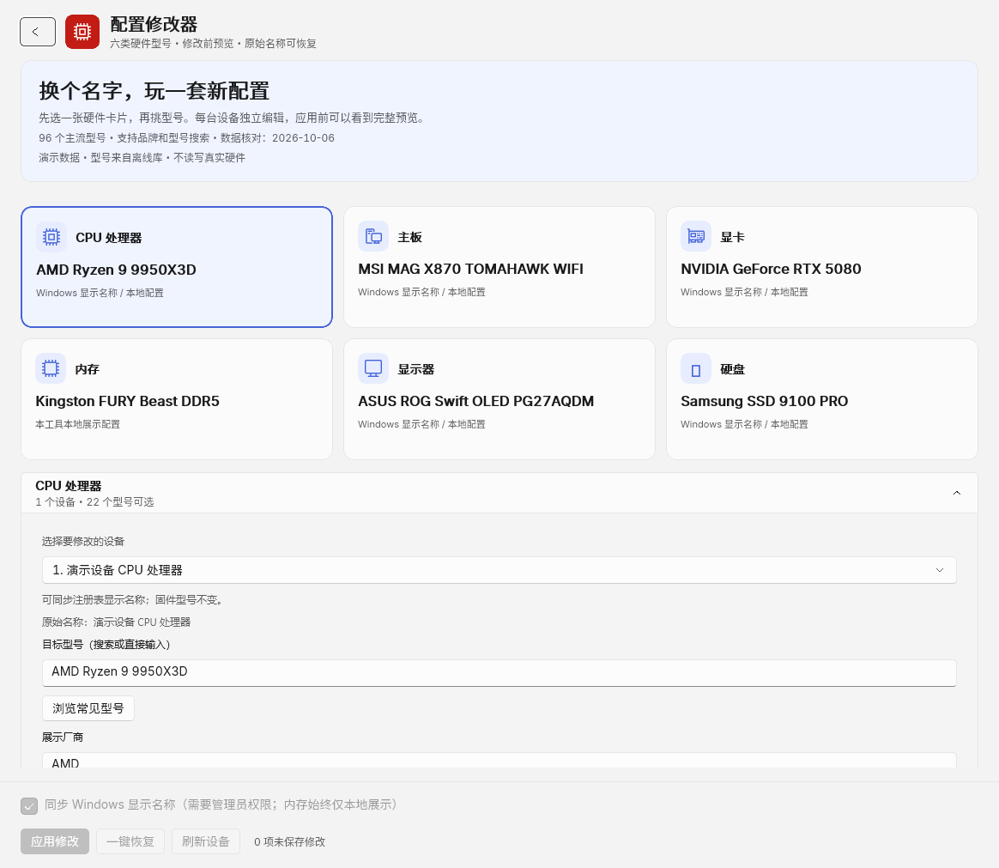
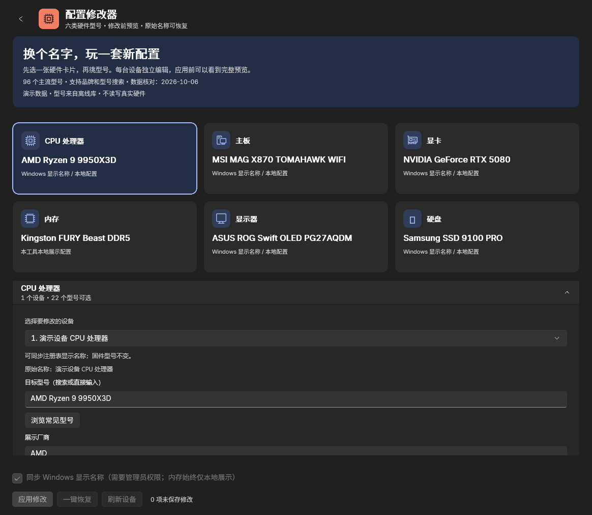

# 枕星配置修改器

独立 Windows 应用，用于编辑 CPU、主板、显卡、内存、显示器和硬盘的展示名称。
基于枕星图吧AI助手配置修改器整理，界面使用 WinUI 3，版本为 0.1.0。
支持 Windows 10 2004（版本 19041）及以上版本与 Windows 11。

[源码仓库](https://github.com/yujinchuan2021-max/zhenxing-hardware-editor) ·
[v0.1.0 下载与校验文件](https://github.com/yujinchuan2021-max/zhenxing-hardware-editor/releases/tag/v0.1.0)

下载 `ZhenxingHardwareEditor-0.1.0-win-x64.zip` 与对应 `.zip.sha256`，
解压整个目录后使用。首发说明见 [v0.1.0](docs/releases/v0.1.0.md)。

## 界面示例

以下为共享编辑界面的合成演示数据，用于展示型号库、六类硬件卡片和主题。
独立版顶栏显示产品名称、版本与主题入口，截图中的设备与名称属于测试演示数据。

浅色主题：



深色主题：



## 支持范围

| 类别 | 修改范围 |
| --- | --- |
| CPU | 本地展示配置；可同步 Windows 注册表中的处理器显示名称 |
| 主板 | 本地展示配置；可同步 Windows 注册表中的主板产品名称和厂商显示字段 |
| 显卡 | 本地展示配置；可同步所选设备的 Windows 友好名称 |
| 内存 | **仅保存在本工具的本地展示配置中**；不修改内存 SPD、固件或 WMI 型号 |
| 显示器 | 本地展示配置；可同步所选设备的 Windows 友好名称 |
| 硬盘 | 本地展示配置；可同步所选设备的 Windows 友好名称 |

修改对象是名称，实际硬件、容量、频率与性能不会改变。固件、WMI 和检测软件可能
继续显示真实型号；重启或驱动更新也可能重置 Windows 名称。多设备按设备标识选择。
未检测到的类别可保存为本地展示配置，不会写入系统。

内置 96 个真实型号/产品系列，包含 Intel、AMD、NVIDIA、ASUS、MSI、GIGABYTE、
ASRock、Kingston、CORSAIR、G.SKILL、Crucial、LG、Samsung、Dell、BenQ、AOC、
SanDisk WD_BLACK 和 Seagate。官方资料核对日期：2026-10-06。
每个条目在 `Services/HardwareModelCatalog.cs` 中保留官方来源。
型号库是本地常量列表，可离线搜索；它不代表实时库存、销售排名或硬件兼容性。

## 使用

1. 解压完整便携包，运行 `ZhenxingHardwareEditor.exe`。系统会请求管理员权限。
2. 选择硬件类别和具体设备，通过品牌/型号搜索或直接填写目标名称。
3. 查看展示配置预览，点击“应用修改”。勾选“同步 Windows 显示名称”时，先备份
   受支持的系统原始字段，然后进行写入和回读校验。取消勾选可只保存本地配置。
4. 使用“一键恢复”还原备份字段。恢复失败项保留备份，便于重新连接设备后重试。

取消同步仅保存本地展示配置，不写入 Windows 名称；当前独立版启动时仍会请求
管理员权限。

顶栏支持跟随系统、浅色和深色主题。数据默认保存到
`%LOCALAPPDATA%\ZhenxingHardwareEditor`。隔离测试可设置当前进程的
`ZXAI_DATA_ROOT` 环境变量，指定另一个数据目录。

## 构建

需要 Windows、.NET SDK 10.0.401（`global.json` 允许同一功能版本的后续修补版），
以及 Windows SDK 10.0.26100。工程通过 NuGet 引入 Windows SDK Build Tools。

```powershell
dotnet build ZhenxingHardwareEditor.csproj -c Release -p:Platform=x64
dotnet test tests/ZhenxingHardwareEditor.Tests.csproj
.\scripts\build-portable.ps1
```

发布包含 .NET 和 Windows App SDK 运行时，不需要安装主版枕星图吧AI助手。
便携包必须保留完整发布目录及许可证文件。测试使用合成设备和临时目录，不修改
运行测试电脑的硬件名称。

便携脚本先运行测试，再发布 x64 应用，检查必需文件并生成 ZIP 和 SHA-256 校验文件。
输出保存在 `artifacts/portable/<本次构建编号>`，每次构建使用独立目录。
已在自定义路径安装 SDK 时可指定 `-DotNetPath 'D:\toolchains\dotnet.exe'`。
脚本也接受 `-RuntimeIdentifier win-arm64`，需要另外在 ARM64 Windows 上验证运行。
开发过程中已通过测试时可用 `-SkipTests` 跳过重复测试。

仓库提供本地测试与便携打包脚本，正式版本由维护者发布。

## 来源与许可证

源自 [枕星图吧AI助手](https://github.com/yujinchuan2021-max/zhenxing-ai-assistant) 的配置修改器。
其上游为 [图吧工具箱 CE / TubaWinUi3](https://github.com/luolangaga/tubatools)，
维护者 luolangaga 及项目贡献者。枕星版由 yujinchuan2021-max 及贡献者维护。
源码以 GPL-3.0 发布，详见 `LICENSE` 和 `NOTICE`；第三方运行时保留各自许可。
